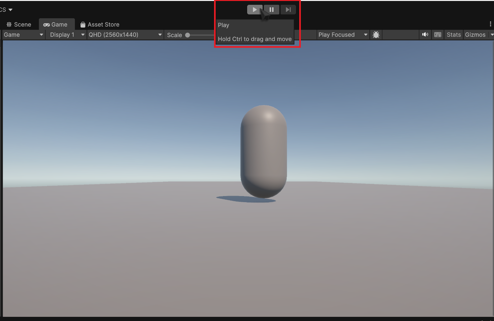
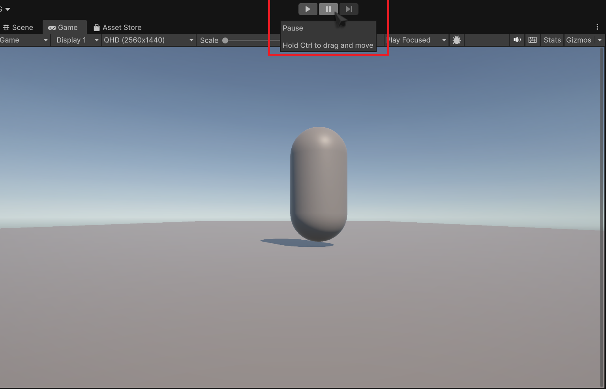

# Creating a Camera Controller Script

In this step, We'll create a simple C# script for using the mouse to look around. while simple, this script will have an easily modifyable sensitivity parameter, as well as clamping the rotation so players can't make the camera look inside the capsule.

1. **Select** your **Main Camera** and **click** *Add Component*.

1. **Type in** what you want to name your script.

    We'll use *mouselook*. **click** *New Script*, and hit enter. Save the script in the same place as your movement Script, and open it up in visual studio.
    You should be met with this:

    ```csharp title="mouselook.cs" linenums="1"
    using UnityEngine;

    public class mouseLooking : MonoBehaviour
    {
        // Start is called once before the first execution of Update after the MonoBehaviour is created
        void Start()
        {

        }

        // Update is called once per frame
        void Update()
        {

        }
    }
    ```

1. **Add** these lines above `using UnityEngine;`:
    ```csharp
    using System.Collections;
    using System.Collections.Generic;
    ```
    These are like packages in python. they expand Unity's capabilities.

1. **Add** the following variables after `public class mouseLooking : MonoBehaviour`:
    ```csharp title="mouselook.cs" linenums="1"
    public class mouseLooking : MonoBehaviour
    {
        public float mouseSensitivity = 100f; //this is our sensitivity value
        public Transform playerBody; //we will assign this a value in the editor
        float xRotation = 0f; //holds the x rotation value so we can clamp it later
        ...
    }

    ```
    
    !!! warning "Variables in C#"

        Unlike Python, C# is *statically typed*. This means the datatype of the variable must be explicitly stated when declaring it. Datatypes are relatively simple, once you get the basics, but coming from Python they can be a little confusing.
        take the mouseSensitivity variable for example:

        `public float mouseSensitivity = 100f;`

        public - visibility modifier. think of this as a way of explicitly defining scope. *public* means it's accessible externally, *private* means it's not, and leaving it out implies *protected*, a pseudo-halfway point.

        float - this is the data type. this means that mouseSensitivity is a floating-point 32-bit number.

        100f - this is the value we're assigning to mouseSensitivity. the **f** explicitly tells the compiler to treat it as a float.

        Another key aspect of C# is that you always end a statement with a semicolon, hence the **;**.

        don't worry about making global variables. global variables are a rarity here, and as long as you declare your vars inside the {} after the class declaration, it's not global.

    !!! warning "forgetting the Semicolon WILL cause your code not to compile!"

1. **Add** inside the *void Start* method:

    ```csharp title="mouselook.cs" linenums="1"
        // Start is called once before the first execution of Update after the MonoBehaviour is created
        void Start()
        {
            Cursor.lockState = CursorLockMode.locked;
        }
    ```
    What this will do is tell the unity project to lock your cursor to the center of the screen.

1. **Press** `Ctrl + S` to save your work and then tab back into Unity.

    Unity will compile your new script, and then give you a warning in the console. Ignore it for now, we'll address it later. 
    You should see two extra fields that share the names of the two public methods we declared.

1. **Press** on the **play** button on the top of the screen.

    

    **Check** that your cursor does lock to the *Game* window (it will dissapear), and when confirmed, press `Esc` to free your cursor and press the stop button.

    

    !!! tip "Testing"

        Testing is a critical part of game development, so test your work often.

1. **add** the following to our script inside `void update()`:
    ```csharp title="mouselook.cs" linenums="1"
        void Update()
    {
        float mouseX = Input.GetAxis("Mouse X") * mouseSensitivity * Time.deltaTime;
        float mouseY = Input.GetAxis("Mouse Y") * mouseSensitivity * Time.deltaTime;
    }
    ```

    This tells unity to start monitoring our mouse movement on both axes. we then multiply by our sensitivity, and then add Time.deltaTime to normalize it.

1. **Add** these lines, inside `Update()` again:
    ```csharp title="mouselook.cs" linenums="1"
    void Update()
    {
        xRotation -= mouseY;
        xRotation = Mathf.Clamp(xRotation, -90f, 90f);
    }
    ```
    this will start recording our Xrotation from mouseY, and then use the `Mathf.Clamp()` to clamp our rotations to a 180 degree field of view.

1. **Add** these in `Update()`:
    ```csharp title="mouselook.cs" linenums="1"
    void Update()
    {
        transform.localRotation = Quaternion.Euler(xRotation, 0f, 0f);
        playerBody.Rotate(Vector3.up * mouseX);
    }
    ```
    this will access the transform of the playerBody object, and use the transform's `.rotate()` function to rotate the playerBody, and by extension, the camera.

1. **Go back into unity**, let your code compile, and test your code!

    in case something doesn't work, you can check against the full script:
    ```csharp title="mouselook.cs" linenums="1"
    using System.Collections;
    using System.Collections.Generic;
    using UnityEngine;

    public class mouselook : MonoBehaviour
    {
        public float mouseSensitivity = 100f;

        public Transform playerBody;

        float xRotation = 0f;
        // Start is called before the first frame update
        void Start()
        {
            Cursor.lockState = CursorLockMode.Locked;
        }

        // Update is called once per frame
        void Update()
        {
            float mouseX = Input.GetAxis("Mouse X") * mouseSensitivity * Time.deltaTime;
            float mouseY = Input.GetAxis("Mouse Y") * mouseSensitivity * Time.deltaTime;

            xRotation -= mouseY;
            xRotation = Mathf.Clamp(xRotation, -90f, 90f);

            transform.localRotation = Quaternion.Euler(xRotation, 0f, 0f);
            playerBody.Rotate(Vector3.up * mouseX);
        }
    }
    ```
    
### Conclusion

In this task, you learned how to: 

- **parent** an Object to another object 
- lock the mouse cursor to the screen using *cursor.lockState*
- access mouse movement data through *MouseX/MouseY*
- use the .Clamp() function to clamp rotations
- use an object's *Transform* component to control it's rotation