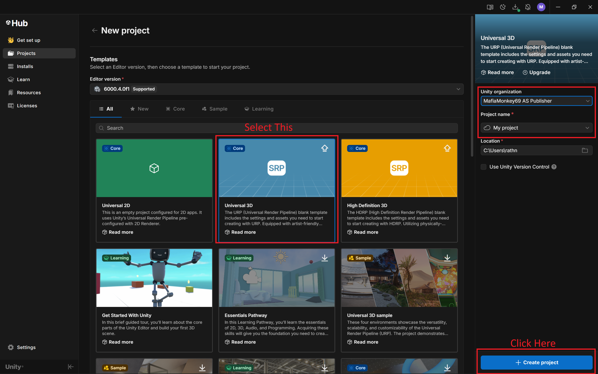

## Content Tabs

This is some examples of content tabs.

### Generic Content

=== "Plain text"

    This is some plain text

=== "Unordered list"

    * First item
    * Second item
    * Third item

=== "Ordered list"

    1. First item
    2. Second item
    3. Third item

### Code Blocks in Content Tabs

=== "Python"

    ```py
    def main():
        print("Hello world!")

    if __name__ == "__main__":
        main()
    ```

=== "JavaScript"

    ```js
    function main() {
        console.log("Hello world!");
    }

    main();
    ```
    
# Getting Started   
Before you start, you need to create a project for your game. One project can have multiple scripts, scenes/environments, models, and a lot more! For this tutorial however, you'll only need a scene, a player model, and a script for that player model.

To create your first project, open Unity hub, click on the **Projects** tab, select **New Project**, then your desired template. We will be choosing **Universal 3D** for our template.

<figure markdown="span">
  { width="700" height="700" }
  
<figcaption>Your new project should automatically open in Unity</figcaption>
</figure>