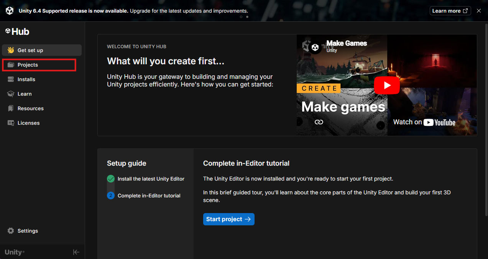
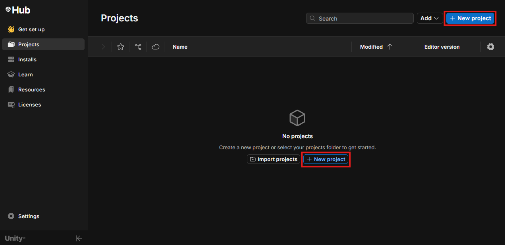
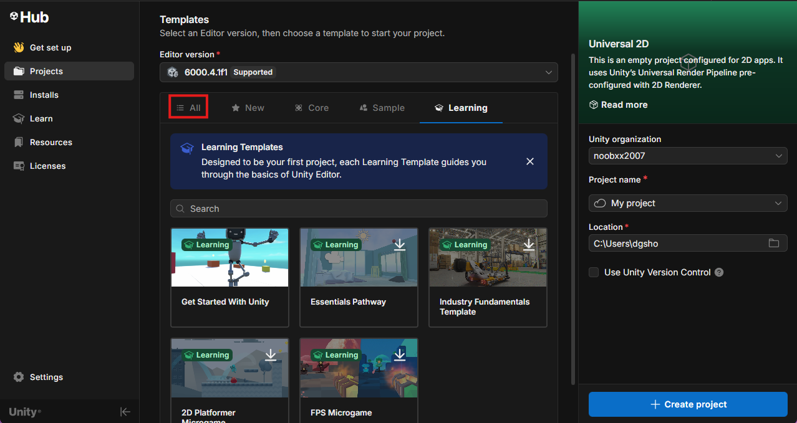
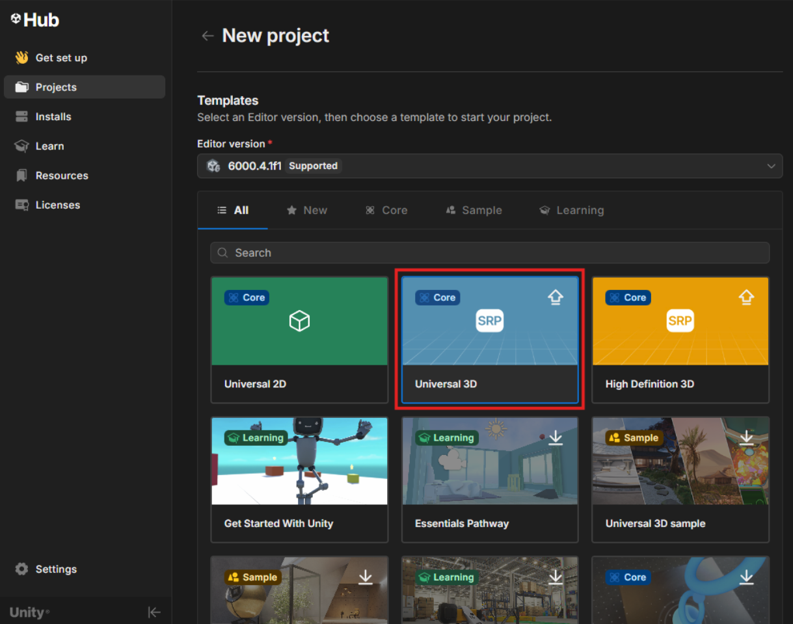
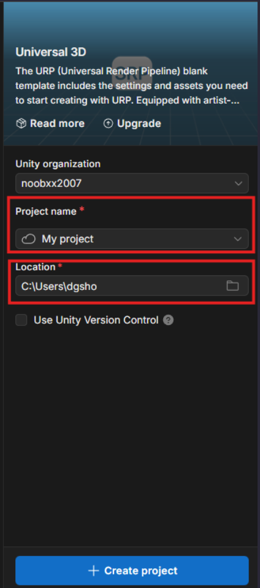
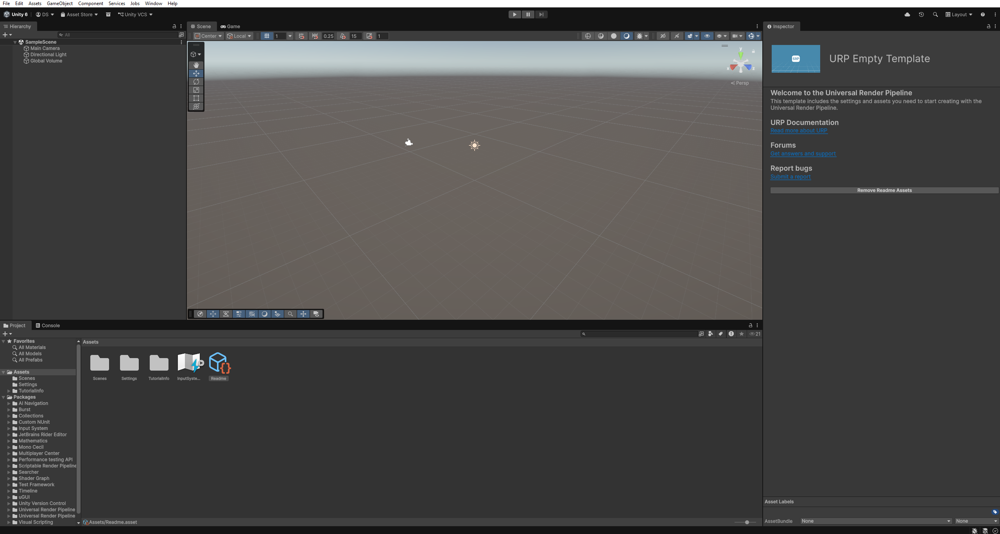
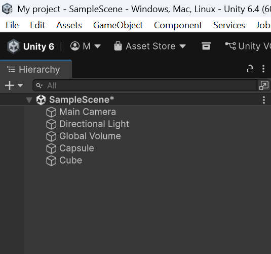
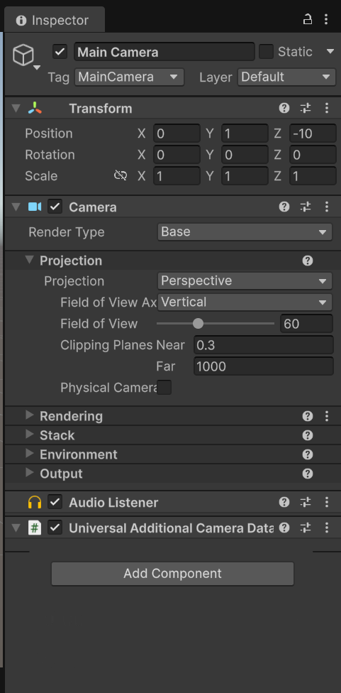
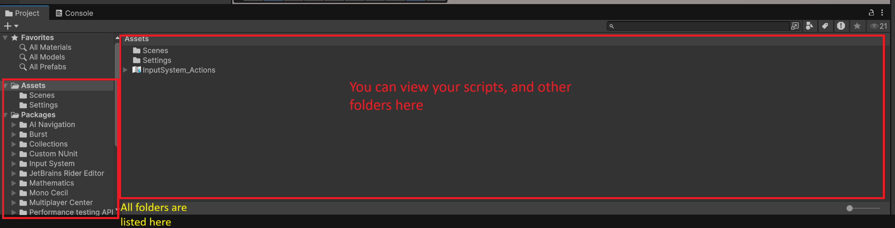
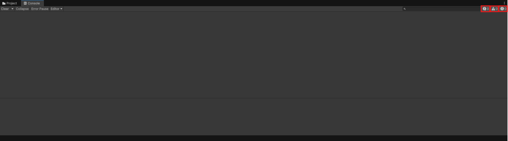

# Project Creation and the Unity Editor
Before you start, you need to create a project for your game. One project can have multiple scripts, scenes/environments, models, and a lot more! In this part of the guide, you will create a new project and learn some information about the unity editor's GUI.

Open the Unity Hub. The Unity hub is how you manage both your projects and your editor installations. It's a rather handy piece of software for keeping Unity organized, and creating new Projects.

### Creating a New Unity Project

1. **Select** the **Projects** tab in the left hand sidebar.
    

??? note "Unity Hub Login"

    If this is the first time you have launched the unity editor, it will ask you to log in first. This allows you to use collected asset store items, as well as using Unity version control (even though git is a better option). Log in using your preferred method, and then Unity Hub will begin installing the latest stable version of unity (v6000.4 as of this guide). Continue on after the installation has finished.

1. **select** either "New Project" buttons.
    
    If you have already created a project, you will only see the button in the top right. If not, both buttons will be visible.

1. **Ensure** you have version *6000.4* under *editor version*. (or the latest release avaliable) selected. 
    Your window should look similar to this:
    

    !!! warning 

        Make sure to **select** the *All* tab, as it may automatically set you to the *Learning* tab.

1. **Select** the **Universal 3D** template.
    

    we will use 3D for this tutorial, so make sure to **Select Universal 3D**.

    ??? question "Why Universal and not High Definition?"

        High Definition 3d uses Unity's advanced render pipeline, which is outside the scope of this guide. HDRP(High-Definition Render Pipeline) provides much better graphical fidelity, but is much more costly on the device running it. URP (Universal Render Pipeline) is built as a general-purpose structure, sacraficing some graphical fidelity for much better performance overall.

1. **Name** the project and indicate where to save the project files using the indicated fields.
    

    we suggest you make a dedicated folder for your projects, something like:
    > C:\users\\[name]\UnityProjects

    This just makes sure you keep your computer organized and makes it easier to keep all game files self-contained for easy in-editor access.

1. **Click** on the *+ Create Project* button, and the editor will start up automatically!
    let the editor boot, and you should be greeted with the basic editor window:
    

    !!! success

        You have created your first project! let's get into How to make this into a game.

### Getting Familiar with the Editor

- The Project Hirearchy

    
    
    This is where you can add, remove or edit GameObjects, cameras, lighting, and everything else you would need for a game 

- The Inspector

    

    This is where you can edit the properties of your objects, and add scripts to the objects.

- The Project tab

    

    This is where you will see all folders, scripts, and textures you have created, along with any other files you need for the project.

- The Console tab

    

    This is where you will see all folders, scripts, and textures you have created, along with any other files you need for the project.

    the highlighted icons show the number of logs("!" in speech bubble), warnings(! in Triangle), and errors(! in octagon) in your code.

    !!! success

        ### Awesome, you can now navigate unity, and we can move on to the next topic: **Scene Creation!**

### Conclusion

In this task, you learned how to:

- Create and set up a new Unity project using Unity Hub.
- Navigate the Unity Editor and learn about the important sections (Hierarchy, Inspector, Project, and Console).
- Understand the different templates (Universal 3D vs High Definition).
- Understand the purpose of different editor tools and how they contribute to game development.