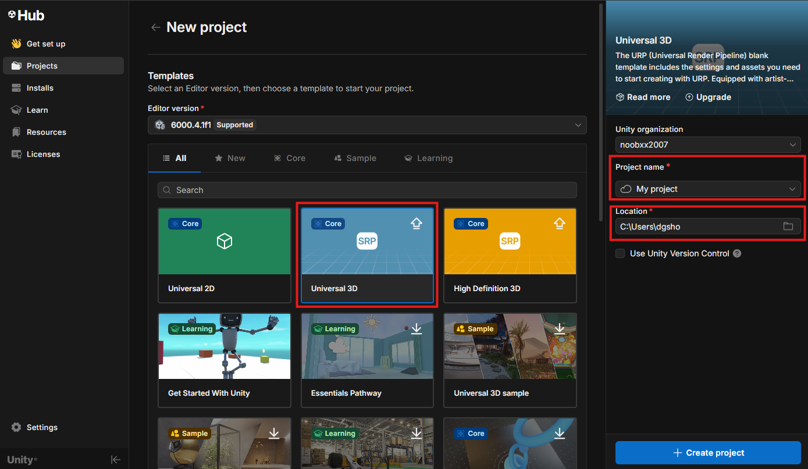

# Project Creation and the Unity Editor
Before you start, you need to create a project for your game. One project can have multiple scripts, scenes/environments, models, and a lot more! In this part of the guide, you will create a new project and learn some information about the unity editor's GUI.

### Creating a New Unity Project
Open the Unity Hub. The Unity hub is how you manage both your projects and your editor installations. select the **Projects** tab in the left hand sidebar.
  

??? tip "Unity Hub Login"

    If this is the first time you have launched the unity editor, it will ask you to log in first. This allows you to use collected asset store items, as well as using Unity version control (even though git is a better option). Log in using your preferred method, and then Unity Hub will begin installing the latest stable version of unity (v6000.4 as of this guide). Continue on after the installation has finished.

??? info "The Unity Hub"

    The Unity hub is a manager for your different unity projects and different installations of the unity editor. for this guide, you don't need to install a different version of the editor, so you can safely ignore alternate editors.

In the **Projects** tab, select either *New Project* buttons.

If you have already created a project, you will only see the button in the top right. If not, both buttons will be visible.

Under *editor version*, ensure you have version *6000.4* (or the latest release avaliable) selected. Your window should look similar to this:

Make sure to select the *All* tab, as it may automatically set you to the *Learning* tab.

Next, select **New Project**, then select the **Universal 3D** template.

we will use 3D for this tutorial, and will not need the help of Unity's advanced rendering capabilities, so make sure to Select *Universal*, and not *High Definition*.

