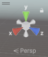
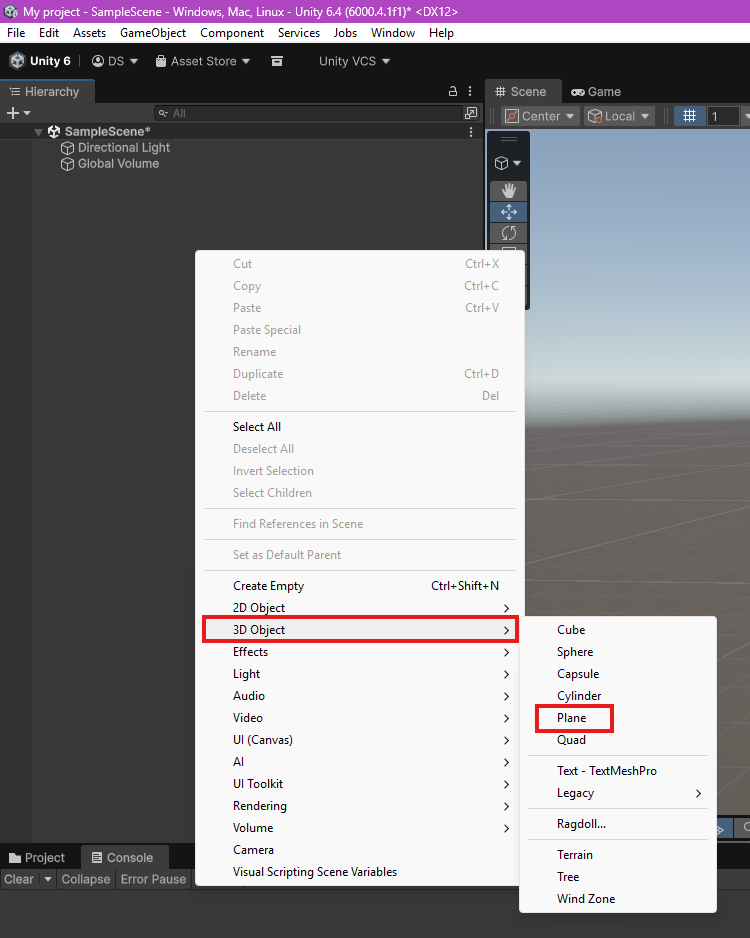
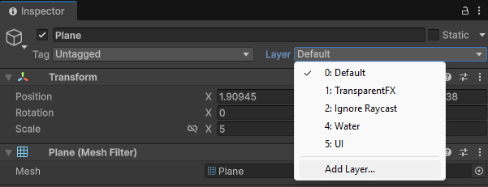
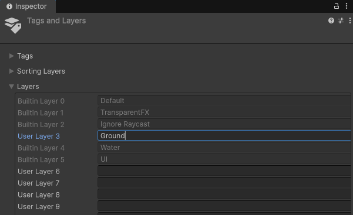
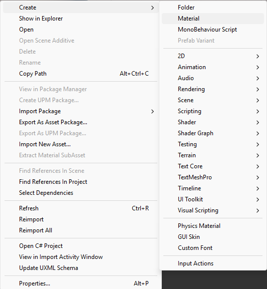
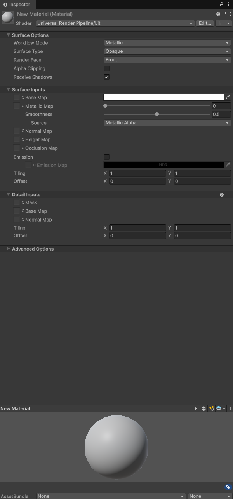
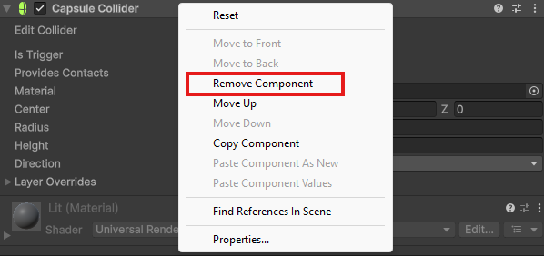
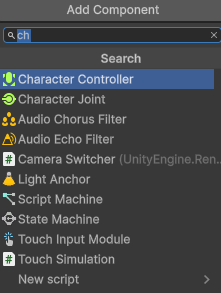
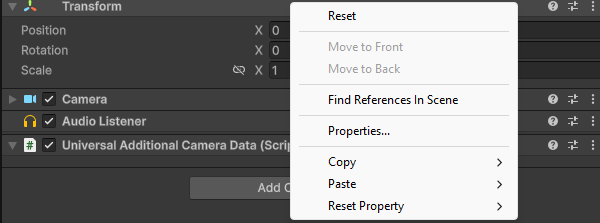
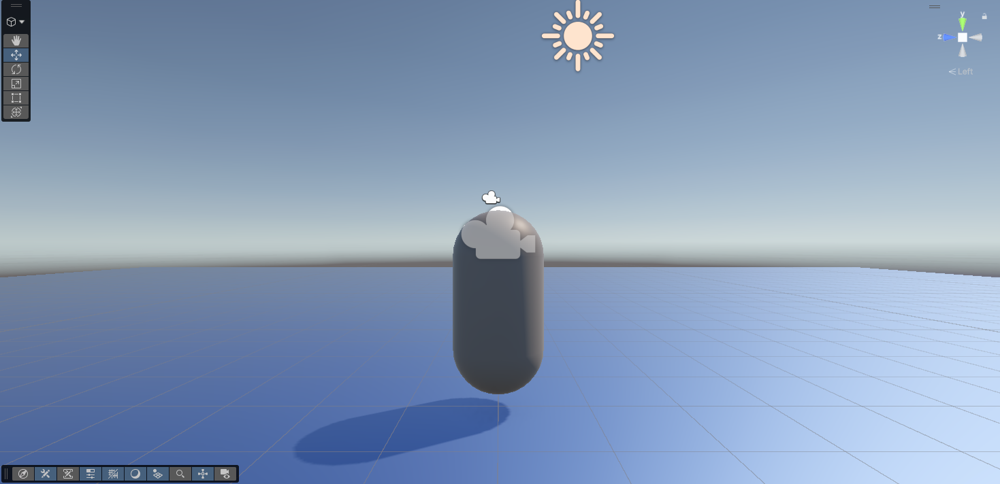

# Scene and Player Creation

Once you have created your project following [part 1](Project-creation.md), we will be greeted with our scene, which has the following: **Main Camera**, **Directional Light** and **Global Volume**. 

!!! tip "Navigating the Scene"

    the *scene* window is a key aspect of the Unity Editor, and in our project it's a 3-D space. To look around, hold right mouse button (RMB) and drag your mouse to look around in your scene. While holding RMB, you can fly around the scene with **W**, **A**, **S**, **D**, or the **Arrow keys**.

    Please note that the camera is **NOT CLAMPED**. This means the camera can rotate in any direction you want, including upside down. to escape this, just **click** on any highlighted cone on this to re-orient the camera quickly:

    

    - **X** sets you to a right-side view
    - **Y** sets you to a top-down view
    - **Z** sets you to a front view 
    
    > you can also switch between a perspective and isometric view by **clicking** on the cube in the center.

In this part of the guide, all we will be doing is adding a platform and creating a player object.

### Adding and modifying a platform
This will give you a bit of familiarity with the tools in the scene editor.

1. **right-click** in the hierarchy window, and a menu will pop up. Go to **3D Object** and **click** "Plane".

    

    This makes a 1x1 plane in your **Scene** window.

1. **Select** the *Scale* tool in the left toolbar of your Scene, and select the plane (orange outline). Use any of the coloured nodes to scale the platform.
    - red scales on the x-axis
    - green scales on the y-axis
    - blue scales on the z-axis

    .png "Scaling")

    !!! warning "Scaling!"

        Unity scales from the center, so any scaling will extend both sides of the platform.

1. Alternatively, you can use the **Transform** option in the Inspector:
    
    Adjust the values under *Scale*.

    .png "Transform Option")

    ??? question "Why would I use one or the other?" 

        You would use transform if you know the exact values you want, while the other option is used for rough proportions. In general, you would be using both these options, the first one would be used for quick prototyping and objects that don't require exact parameters. Then, you would use the inspector to set precise values for scale, rotation and/or position of the objects.
      

    no matter what method you choose, scale your platfom to your desired width and length (we chose 5x5).

1. **Find** the dropdown menu titled **Layer** in the plane's **Inspector** window, and expand it.

    

1. **Select** *Add Layer...* and under *User Layer 3*, type in *Ground*.

    

    this creates a new *LayerMask*, and dictates what our player model should be standing on. we mainly use it for enabling/disabling the player's ability to jump based on whether the player is grounded or not.

    make sure to go back to your plane's Inspector window and set *layer* to our new *Ground* layerMask.

    ??? question "What the heck does "LayerMask" Mean?"

        Think of LayerMasks similar to layers in photoshop or paint. We use layerMasks as a general way to group objects together, like setting obstacles in a course to the *Obstacle* layer, or all the enemies in a level to the *Enemy* layer. this is handy for our code, as it allows us to include many objects in one condition instead of having to directly reference them all individually.

1. **Right click** in your **Project** window and navigate to *Create* > *Material*.

    

    - Give the new Material a name, a simple one like *Floor Material* will work fine.
    - In the material's Inspector, **click** on the long white bar across from *Base Map* and select a colour.

    

    - Once you're happy with your material, simply **click** and drag the material from the **Project** window onto the plane in your **Scene** window.

    

    ??? tip "Expanding your Materials"

        The material editor is deceptively complex, and has a lot of power. Feel free to mess about with the sliders for *Metallic Map* and *Smoothness* to adjust your materials gloss and visual texture. 
        It also gives options for all forms of detailed customization, such as normal and height maps. i suggest avoiding these if you are unfamiliar with them, as they can look terrible if done incorrectly.

### Creating a Player model

in order to have a game, we need a player. In order to have a player, we need a model for your game. A player model can be something as simple as a Capusle (sometimes called a "bean"). For this part of the tutorial, we will only be creating a simple player model using a capsule.

1. **Right-click** in the hierarchy window, Go to 3D Object and **select** "Capsule" (Same way we made the Plane).

1. **Move** the capsule upwards using the arrows until it's fully visible.

1. **set** *x*, *y*, and *z* = 2 in the **Transform** section of the capsule's inspector window.

    You can also **click** on the text box containing *Capsule* and rename it, (*Player* should do fine).

1. **Right click** on **Capsule Collider** in the inspector window and **select** "Remove Component".

    

1. **Click** "Add Component" at the bottom of the inspector window and search for "Character Controller". click on it to add it to our player object.

    

1. **Select** *Main Camera* In the **hirearchy** window. right click on **Transform**, and click **Reset**.

    

1. **Use the arrows to position the camera**In the scene window roughly at the top of the player capsule.

    Position it so from a side view, the camera icon pokes just overtop of the capsule.

    

    ??? tip "Getting a good view"

        If you need to get a good angle on your models, just select your model and hit 'F' on your keyboard. This way, you don't have to keep fidgeting with your mouse to get the right angle. 

1. **Click** and drag the camera overtop of our player object. this will parent the camera to the player object.

    ??? question "What's parenting an object?"

        Parenting is simply attaching one object to another, essentially linking an objects size and position to a parent object.

1. **Right click** on **Player** and select "Create Empty" from the menu (this automatically makes the new empty a child of Player). 

1. **Use the arrows** to move this downwards to roughly the bottom of the capsule.

1. **Rename** this new empty GameObject to *GroundCheck* in the *inspector* window. (this will come up later.)

!!! success "Part 2 Complete!"

## Conclusion

In this task, you learned how to: 

- Navigate a **Scene**
- Add and scale a platform
- Add a layermask to your platform
- Add a new material for your platform
- Create a player model
- Scale your player model
- Add a `Character Controller` to your player

Scene creation is an import aspect to understand when creating a Unity game. The more you familiarize yourself with the Scene editor, the easier it becomes! 
