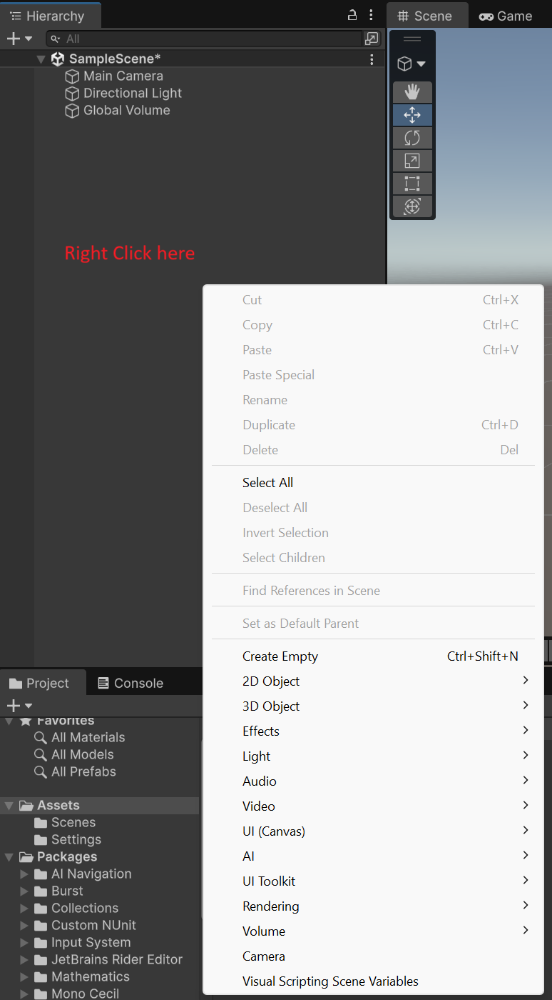
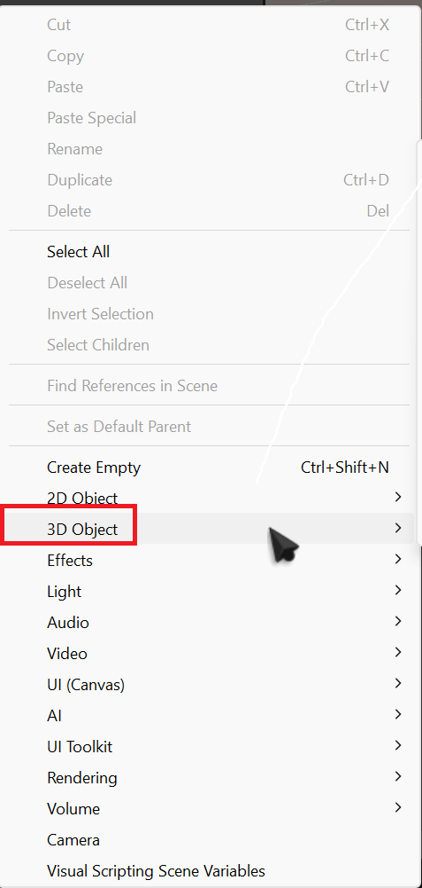
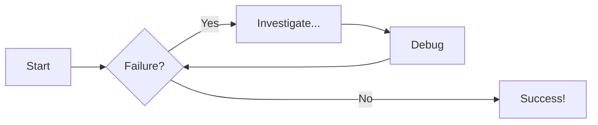
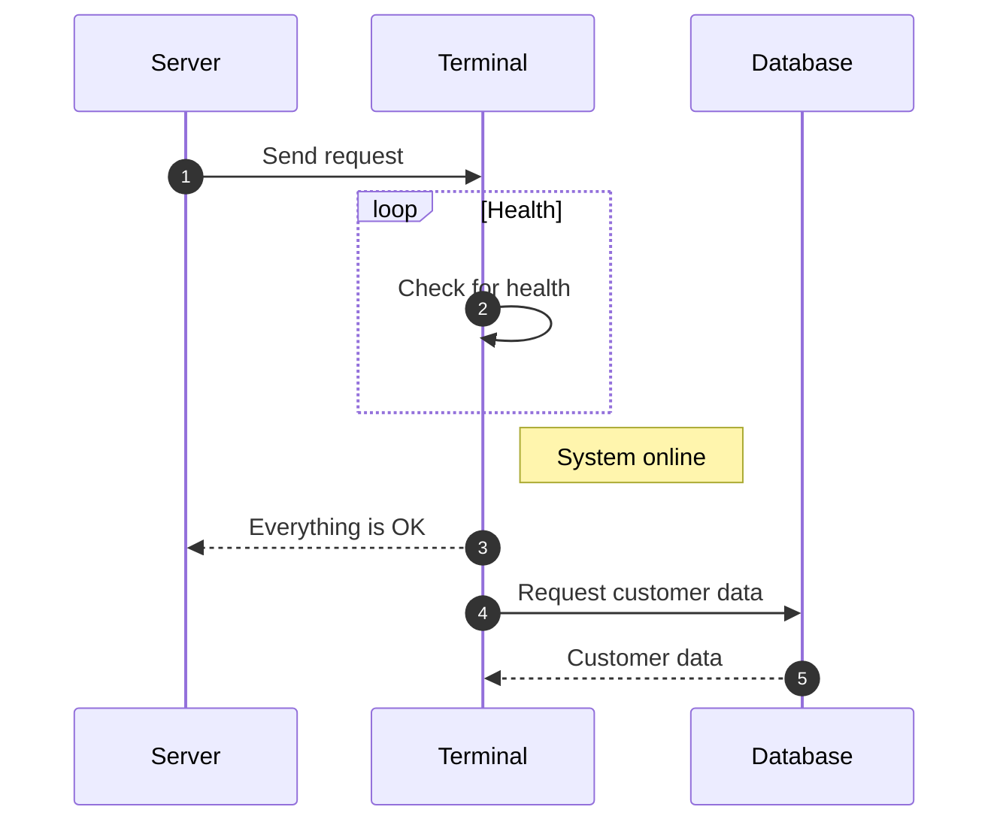

# Scene Creation

Once you have created your project following the steps [here](Project-creation.md), we will be greeted with our scene which have the following: **Main Camera**, **Directional Light** and **Global Volume**. We don't have to worry about these objects for now.

{ width="700" height="700" }

??? tip "Navigating the Scene"

    Navigating the Scene can be difficult, so here are two quick tips: to move around, hold middle mouse button, and use drag your mouse to navigate. To just look around, hold right mouse button and drag your mouse to look around in your scene.

In this part of the guide, all we will be doing is adding a platform, so your player model has something to walk on. (add more steps if needed).

### Adding a platform
1. right-click on the hierarchy, and a menu will pop up

    { width="700" height="700" }

1. hover over  

    

1. select either cube or plane, both work for a basic platforms

    .png)

### Scaling the platform
Once you have selected the your object (either cube or plane), it is now time to scale it.

1. Select "Scale" in the left toolbar of your Scene

    .png)

1. To scale your object, you have 3 thingies(idk what to call them). You can use the green to scale on the y-axis, red to scale on the x-axis, and blue to scale on the z-axis

    .png)

1. Alternatively, you can use the "Transform" option in the Inspector

# Diagram Examples

## Flowcharts

## Sequence Diagrams

