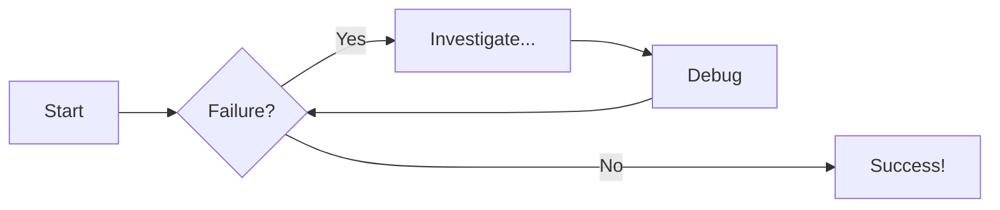
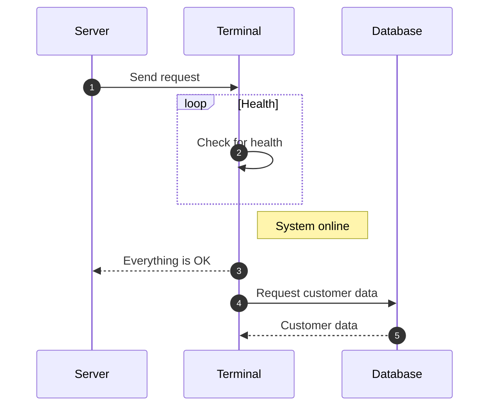

# Scene Creation

This document will cover correctly configuring the Scene for your first unity program. Namely, ensuring that the correct .... The steps here will be the same regardless of your operating system. 

1. Open unity hub and install the latest Unity editor. 

2. 

# Diagram Examples

## Flowcharts

## Sequence Diagrams

