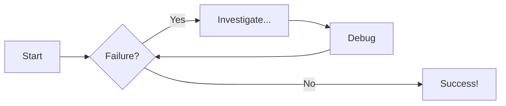
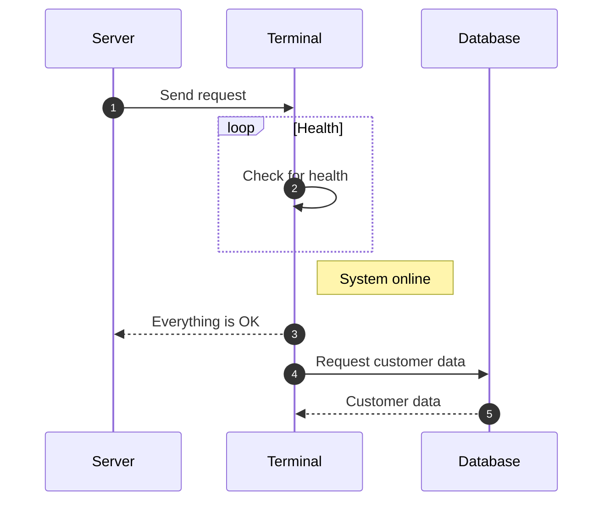

# Scene Creation

Once you have created your project following [part 1](Project-creation.md), we will be greeted with our scene which have the following: **Main Camera**, **Directional Light** and **Global Volume**. We don't have to worry about these objects for now.

{ width="700" height="700" }

??? tip "Navigating the Scene"

    the *scene* window is a key aspect of the Unity Editor, and in our project it's a 3-D space. To look around, hold right mouse button (RMB) and drag your mouse to look around in your scene. While holding RMB, you can fly around the scene with **W**, **A**, **S**, **D**, or the **Arrow keys**.

    Please note that the camera is **NOT CLAMPED**. This means the camera can rotate in any direction you want, including upside down. to escape this, just click on any highlighted cone on this to re-orient the camera quickly:

    

    - **X** sets you to a right-side view
    - **Y** sets you to a top-down view
    - **Z** sets you to a front view 
    
    > you can also switch between a perspective and isometric view by clicking on the cube in the center.

In this part of the guide, all we will be doing is adding a platform, so your player model has something to walk on. (add more steps if needed).

### Adding a platform
1. right-click on the hierarchy, and a menu will pop up

    { width="700" height="700" }

1. hover over  

    

1. select either cube or plane, both work for a basic platforms

    .png)

### Scaling the platform
Once you have selected the your object (either cube or plane), it is now time to scale it.

1. Select "Scale" in the left toolbar of your Scene

    .png)

1. To scale your object, you have 3 thingies(idk what to call them). You can use the green to scale on the y-axis, red to scale on the x-axis, and blue to scale on the z-axis

    .png)

1. Alternatively, you can use the "Transform" option in the Inspector

# Diagram Examples

## Flowcharts

## Sequence Diagrams

