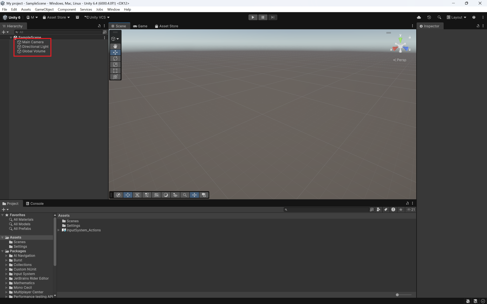
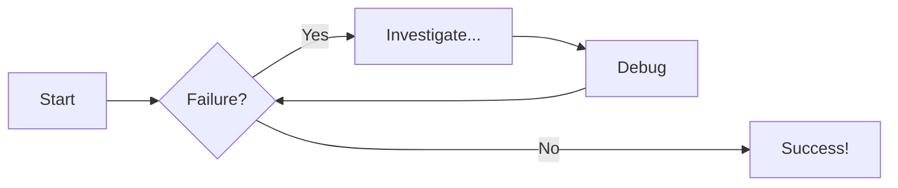
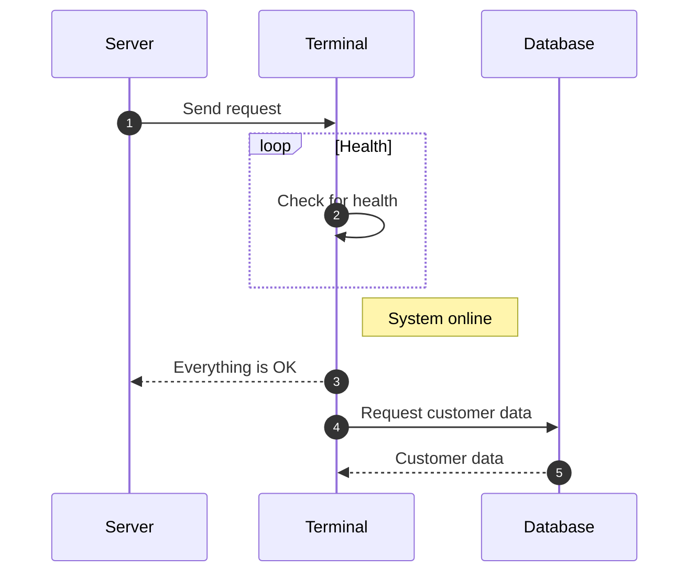

# Scene Creation

Once you have created your project following the steps [here](Project-creation.md), we will be greeted with our scene which have the following: **Main Camera**, **Directional Light** and **Global Volume**. We don't have to worry about these objects for now.

<figure markdown="span">
  { width="700" height="700" }
  
<figcaption></figcaption>
</figure>

??? tip "Navigating the Scene"

    Navigating the Scene can be difficult, so here are two quick tips: to move around, hold middle mouse button, and use drag your mouse to navigate. To just look around, hold right mouse button and drag your mouse to look around in your scene.

In this part of the guide, all we will be doing is adding a platform, so your player model has something to walk on. (add more steps if needed).

# Diagram Examples

## Flowcharts

## Sequence Diagrams

