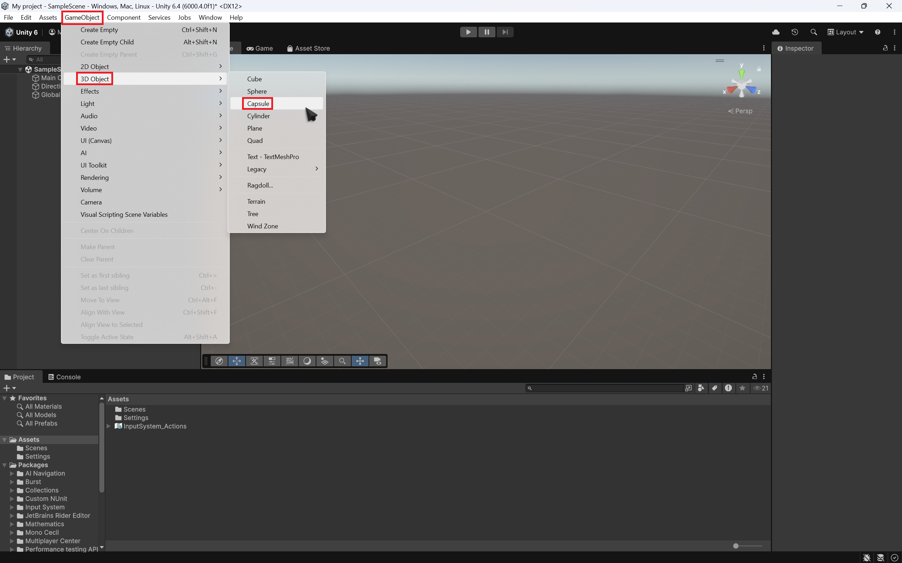
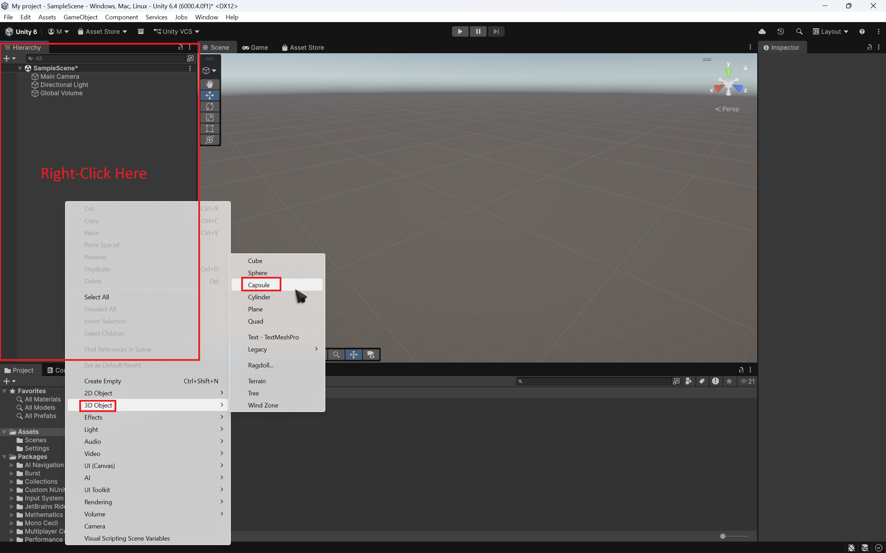

# Creating a Player model  

Before you start scripting, you need to create a player model for your game. A player model can be something as simple as a bean, or something as complex as realistic humanoid. For this part of the tutorial, we will only be creating a simple "bean" player model.

To create your player model, hover over the **GameObject** option on the top-bar, hover over the **3D Object** tab, then select **Capsule**. We select capsule, because it's very easy to work with for beginners.

{ width="700" height="700" }
Alternatively, you can right-click on the Hierarchy, and follow the same steps as listed above.  

{ width="700" height="700" }
Once you have done that, you will now see a fresh bean-looking model in your scene and in your hierarchy

{ width="700" height="700"}

??? tip "Quick Editing"

    If you need to get a good angle on your models, just select your model and hit 'F' on your keyboard.
    This way, you don't have to keep fidgeting with your mouse to get the right angle. 

Now, we will need to add a camera for the player model
