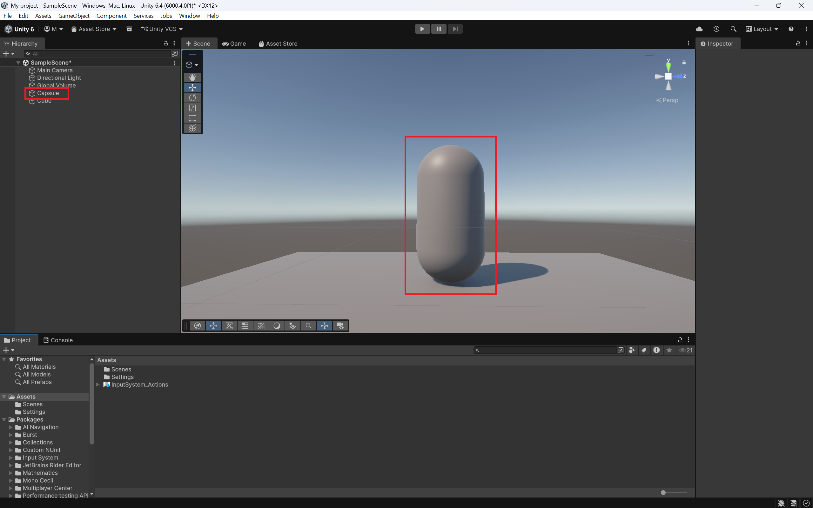

# Creating a Player model  

Before you start scripting, you need to create a player model for your game. A player model can be something as simple as a bean, or something as complex as realistic humanoid. For this part of the tutorial, we will only be creating a simple "bean" player model.

To create your player model, hover over the **GameObject** option on the top-bar, hover over the **3D Object** tab, then select **Capsule**. We select capsule, because it's the best basic player model according to the internet.

<figure markdown="span">
  { width="700" height="700" }
  
<figcaption>Your player model will show up on the highlighted Hierarchy</figcaption>
</figure>

Alternatively, you can right-click on the Hierarchy, and follow the same steps as listed above.  

<figure markdown="span">
  { width="700" height="700" }
  
<figcaption>Both options are fine</figcaption>
</figure>

Once you have done that, you will now see a fresh bean-looking model in your scene and in your hierarchy

<figure markdown="span">
  { width="700" height="700" }
  
<figcaption>You scene and hierarchy should look similar to this</figcaption>
</figure>